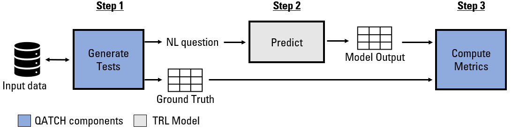
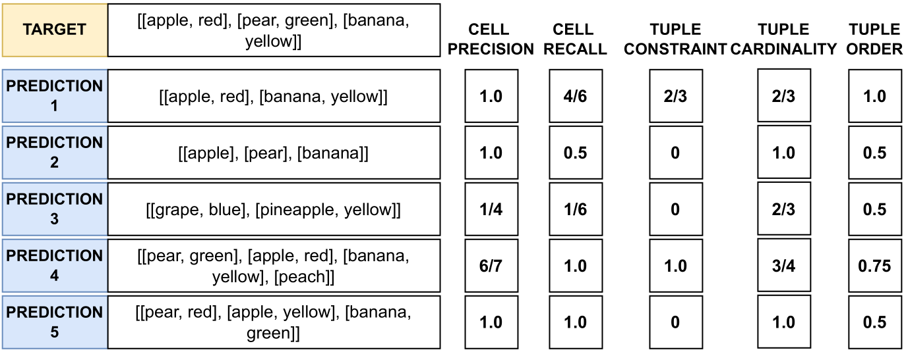
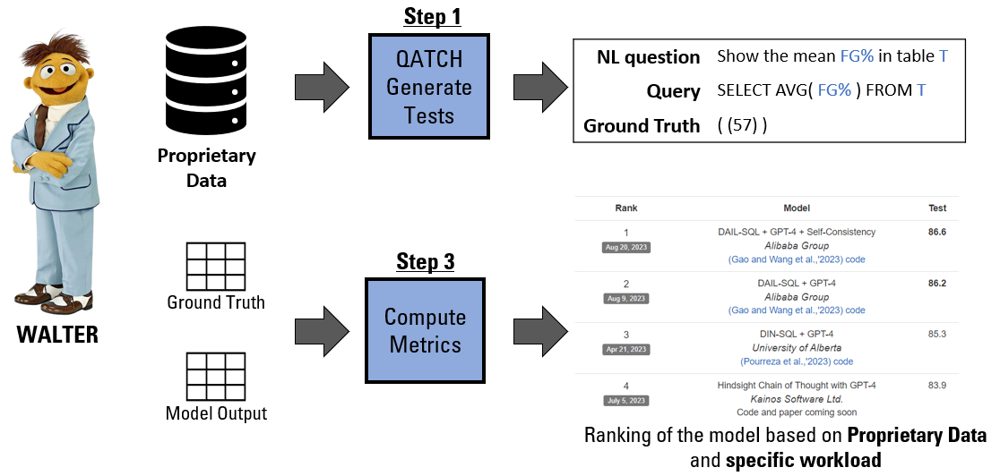

# QATCH: Benchmarking SQL-centric tasks with Table Representation Learning Models on Your Data

<p align="center">
 <kbd>
  
 </kbd>
 </p>

This repository is the official implementation
of [QATCH: Benchmarking SQL-centric tasks with Table Representation Learning Models on Your Data](https://openreview.net/forum?id=XOpaPrb0U5)
NeurIPS Dataset and Benchmark track 2023.

# 🔥 Updates
- [**2024-Dec-03**]: Introduce new metrics from literature: Execution Accuracy and Valid Efficiency Score (VES)
- [**2024-Dec-02**]: new version of QATCH based on LangGraph! Test Generation and Evaluation is now executed in parallel
- [**2024-Jan-22**]:
  Add [DAMBER: (Data-AMBiguity testER)](https://github.com/spapicchio/QATCH/tree/master/damber#readme)
- [**2024-Jan-10**]: Add JOIN tests for proprietary data
- [**2023-Dec-15**]: new License: Apache-2.0
- [**2023-Nov-06**]: Camera ready version is now available! [check it out](https://openreview.net/forum?id=XOpaPrb0U5)!
- [**2023-Nov-05**]: QATCH can now be donwloaded from pip! Do not forget to check
  the [documentation](https://spapicchio.github.io/QATCH/)!

# 🏴󠁶󠁵󠁭󠁡󠁰󠁿 Overview

[](https://colab.research.google.com/drive/1SNoy3GZGPWltVS5cL068xAG9YoPS_3_l?usp=sharing)

* ***What is QATCH?*** **Q**uery-**A**ided **T**RL **Ch**ecklist (QATCH) is a toolbox to highlight TRL models’ strengths
  and weaknesses on prorietary tables for Question Answering (QA) and Semantic Parsing (SP).
* ***How does it work?*** Given a proprietary database as input, it generates a testing checklist for QA and SP.
* ***More specifically?*** A query generation algorithm crafts tests by means of the expressive power of SQL.
* ***Ok cool, that's it?*** To evaluate the model's predictions, we propose 5 new metrics intra and inter tuple.
* ***Where is processed the data?*** The data is processed locally. We do not store any data. If you use the ChatGPT
  wrapper the data is processed by OpenAI.
* ***Where can I check the results?*** The generated tests along with the predictions and the metric scores can be
  downloaded [here](https://drive.google.com/uc?export=download&id=1_z8N52QNAHnxpHv54VhbvYu7DbKV6QRv). This is to
  prevent the costly generation of test results with the openAI API and to build trust in our results.

 <figure style="text-align:center">
  
</figure>

<br>

QATCH's automatically generates and evaluates test checklists on TRL models based on the three-step process depicted
below:

1. *QATCH-Generate*. It generates a set of queries tailored to proprietary data. For each query it formulates both the
   SQL declaration, its free-text version, and the expected ground truth consisting of table instances.
   The SQL declaration expresses the logical complexity of the query and reflects the presence/absence of specific
   features peculiar to relational data model such as presence of missing values and duplicate values.

2*QATCH-Evaluate*. It evaluates the models outputs according to a novel set of cross-task performance metrics, .

<p align="center">

</p>

QATCH’s metrics are computed between the model output (prediction) and expected
ground-truth results (target). The target is the answer of the NL question "Show me all the data" over
a table with three tuples and two attributes.
<br>

Given the ground truth result (target) with three tuples over two attributes, we report the metric values for five
predictions, coming either from a QA or from the execution of a query in SP. More details can be found in
the [metrics](qatch/metrics_evaluators) folder

## Who should use QATCH?

QATCH is designed to create "behavioral testing" checklist for QA and SP tasks.
The checklist is used to understand in which case the models fail when processing proprietary data for QA and SP tasks.

In a corporate setting, there are at least three scenarios where a given TRL model needs to be evaluated
against proprietary datasets:

- Comparison: Compare TRL models fine-tuned on private examples to see which one performs best.
- Validation: As crafting examples is expensive, verify when the quality meets the requirements.
- Maintenance: Fine-tuned models need to be re-calibrated to avoid data and conceptual shifting,
  continuous evaluation helps the identification of this issue.

But the usage of QATCH it is not limited to the TRL models. Indeed, we propose two scenarios
where QATCH can be used with LLMs:

- LLM compatibility version: Compare different version of the same LLMs to see the best performing one.
- Prompt engineering: Analyse the best prompt definition based on the proprietary data.

<p align="center">

</p>

Use case example of engineer Walter.
With QATCH it is able to create a model ranking on his proprietary data for QA and SP.

## Project

```shell
|--qatch
    |-- connectors  # handles the connections with the database
        |-- base_connectors.py  # interfacte for connectors
        |-- sqlite_connectors.py  # concrete SQLite connectors
    |-- evaluate_dataset # handles the execution in parallel of the metrics
        |-- orchestrator_evaluator.py  # orchestrator used to execute in parallel the metrics
        |-- state_orchestrator_evaluator.py  # state passed among the nodes of the Graph
        |-- metrics_evaluators  # handles execution of the metrics
            |-- base_evaluator.py  # interface for base evaluator
            |-- execution_accuracy.py  # implements execution accuracy
            |-- cell_precision.py # implement cell precision
            |-- cell_recall.py # implement cell recall
            |-- tuple_cardinality.py # implement tuple cardinality 
            |-- tuple_constraint.py # implement tuple constraint 
            |-- tuple_order.py # implement tuple order 
    |-- generate_dataset  # handles the generation of the dataset
        |-- orchestrator_generator.py  # orchestrator used to execute in parallel the checklist generation
        |-- state_orchestrator_generator.py  # state passed among the nodes of the Graph
        |-- checklist_generaotors
            |-- base_generator.py # interface for base generator
            |-- select_generator.py # implement SELECT tests
            |-- distinct_generator.py # implement DISTINCT tests
            |-- orderby_generator.py # implement ORDERBY tests
            |-- where_generator.py # implement WHERE tests
            |-- groupby_generator.py # implement GROUPBY tests
            |-- having_generator.py # implement HAVING tests
            |-- simple_agg_generator.py # implement SIMPLE AGG tests
            |-- null_generator.py # implement NULL generator tests
            |-- null_generator.py # implement NULL generator tests
            |-- join_generator.py # implement JOIN generator tests
            |-- many_to_many_generator.py # implement a more complex pattern

```

## Citation

If you are using this work please cite the following papers:

```bibtex
@inproceedings{papicchioqatch,
  title={QATCH: Benchmarking SQL-centric tasks with Table Representation Learning Models on Your Data},
  author={Papicchio, Simone and Papotti, Paolo and Cagliero, Luca},
  booktitle={Thirty-seventh Conference on Neural Information Processing Systems Datasets and Benchmarks Track}
}
```

```bibtex
@inproceedings{papicchio2024evaluating,
  title={Evaluating Ambiguous Questions in Semantic Parsing},
  author={Papicchio, Simone and Papotti, Paolo and Cagliero, Luca},
  booktitle={2024 IEEE 40th International Conference on Data Engineering Workshops (ICDEW)},
  pages={338--342},
  year={2024},
  organization={IEEE Computer Society}
}
```

# ⚡️ Quickstart

## Installation

You can install QATCH by running the following commands:

```console
# Using poetry (recommended)
poetry add QATCH

# Using pip
pip install QATCH 
```

## How to use QATCH with my data?

1. Load your input data

Create a connection between your data and the tool.
If your data is not stored in a sqlite database you can use our code to generate it.

```python
import pandas as pd

from qatch.connectors.sqlite_connector import SqliteConnector

# Create dummy table
data = {
    "id": [0, 1, 2, 3, 4, 5],
    "year": [1896, 1900, 1904, 2004, 2008, 2012],
    "city": ["athens", "paris", "st. louis", "athens", "beijing", "london"]
}
table = pd.DataFrame.from_dict(data)

# define the tables in the database (<table_name> : <table>)
db_tables = {'olympic_games': table}

# Assume the PKs have all different names. Two tables cannot have same PK name.
table2primary_key = {'olympic_games': 'id'}

# define where to store the sqlite database
db_save_path = 'test_db.sqlite'

# define the name of the database
db_id = 'olympic'

# create database connection
connector = SqliteConnector(
    relative_db_path=db_save_path,
    db_name=db_id,
    tables=db_tables,
    table2primary_key=table2primary_key
)
```

This class will create the sqlite database in db_save_path.

If you want to directly connect to the sqlite database:

```python
from qatch.connectors.sqlite_connector import SqliteConnector

db_save_path = 'test_db.sqlite'
db_name = 'olympics'
connector = SqliteConnector(
    relative_db_path=db_save_path,
    db_name=db_name,
)
```

2. QATCH-Generate: Generates the tests
   To generate the datasets, we need an orchestrator:

```python
from qatch.connectors.sqlite_connector import SqliteConnector
from qatch.generate_dataset.orchestrator_generator import OrchestratorGenerator

# connection to the database
connector = SqliteConnector(
    relative_db_path='<your_sqlite_path>',
    db_name='<your_db_name>',
)

# init the orchestrator
orchestrator_generator = OrchestratorGenerator()

# test generation
orchestrator_generator.generate_dataset(connector)
```

3. QATCH is intended to be used without the inference step. the new release of QATCH deprecate this section.
   For reproducibility purposes, refer to previous main version of QATCH starting with 0.*

4. QATCH-Evaluate: Evaluate the results with all the available metrics.
Supported metrics are:
- Execution Accuracy: {0, 1} whether the execution of the query is the same or not.
- Valid Efficiency Score: [0, +infinite) whether the execution of the query is the same or not.
- Cell Precision: [0, 1] how many predicted elements are in target
- Cell Recall: [0, 1] how many target elements are in prediction
- Tuple Cardinality: [0, 1] whether cardinality of target and prediction matches
- Tuple Constraint: [0, 1] whether the tuple constraint is respected or not 
- Tuple Order: [0, 1] whether prediction and target contains same order, calculated only for target query with ORDER-BY clause

```python
from qatch.evaluate_dataset.orchestrator_evaluator import OrchestratorEvaluator

# init orchestrator evaluator 
evaluator = OrchestratorEvaluator()
# Returns: The input dataframe enriched with the metrics computed for each test case.
evaluator.evaluate_df(
    df='<the pandas df>',
    target_col_name='<target_column_name>',
    prediction_col_name='<prediction_column_name>',
    db_path_name='<db_path_column_name>'
)
```

The final dataframe contains:

- *db_id*: The database name associated with the test.
- *tbl_name*: The table name associated with the test.
- *sql_tags*: the SQL generator associated with the test.
- *query*: The generated query from step 1.
- *question*: The generated question from step 1. Used as input for the model.
- *predictions_<model_used>*: The predicted query/cells from step 2.
- *5 metrics*: The metrics used to evaluate the models.

# 🏰 Reproduce Experiments

## Step 0: Install and prepare data

We suggest to create a *data* folder in the project to store all the data but it is not mandatory.

```bash
mkdir data/
```

These are the tables we use to generate the results in the main paper. <br>
Notice that QATCH perfectly works with any table and the following are only a selected sample to higlight results in the
paper.

 Data               | Link                                                                                                | # rows | # categorical cols | # numerical cols | example cols                 
--------------------|-----------------------------------------------------------------------------------------------------|--------|--------------------|------------------|------------------------------
 Spider             | [link](https://yale-lily.github.io/spider)                                                          | -      | -                  | -                | -                            
 Sales-transactions | [link](https://www.kaggle.com/datasets/gabrielramos87/an-online-shop-business)                      | 500k   | 5                  | 3                | ProductNo, Date              
 Fitness-trackers   | [link](https://www.kaggle.com/datasets/devsubhash/fitness-trackers-products-ecommerce)              | 565    | 8                  | 3                | Brand Name, Display          
 Account-fraud      | [link](https://www.kaggle.com/datasets/sgpjesus/bank-account-fraud-dataset-neurips-2022)            | 1M     | 4                  | 26               | DaysSinceRequest, Velocity6h 
 Late-payment       | [link](https://www.kaggle.com/datasets/hhenry/finance-factoring-ibm-late-payment-histories)         | 2466   | 6                  | 6                | InvoiceDate, Disputed        
 Heart-attack       | [link](https://www.kaggle.com/datasets/rashikrahmanpritom/heart-attack-analysis-prediction-dataset) | 303    | 1                  | 11               | # trtbps, # oldpeak          
 Breast-cancer      | [link](https://www.kaggle.com/datasets/utkarshx27/breast-cancer-dataset-used-royston-and-altman)    | 686    | 5                  | 6                | pgr, rfstime                 
 Adult-census       | [link](https://www.kaggle.com/datasets/uciml/adult-census-income)                                   | 32.6k  | 9                  | 6                | education, fnlwgt            
 Mushrooms          | [link](https://www.kaggle.com/datasets/uciml/mushroom-classification)                               | 8.1k   | 23                 | 0                | cap-shape, ring-type         

The experiments using JOIN involved specific, joinable tables from the following datasets:

Domain | Full Name | Link                                                                            | Selected tables           
--------------------|-----------------------|---------------------------------------------------------------------------------|-----------------------
Medicine | MIMIC-III | [link](https://www.kaggle.com/datasets/asjad99/mimiciii)                        |admissions, callout, caregivers, caregivers             
Finance | Home Credit Default Risk | [link](https://www.kaggle.com/datasets/megancrenshaw/home-credit-default-risk)  |application, bureau, bureau_balance, credit_card_balance, installments_payments, previous_application       
Ecommerce | Instacart Market Basket | [link](https://www.kaggle.com/c/instacart-market-basket-analysis/data)          |aisles, department, products, order_products, orders

## Step 1: Generate tests

Once we have downloaded the datasets, the generation of the checklist can be executed with the following commands:

```python
import pandas as pd

from qatch.connectors.sqlite_connector import SqliteConnector
from qatch.generate_dataset.orchestrator_generator import OrchestratorGenerator

db_save_path = '<path_to_proprietary_dataset>.sqlite'
db_name = '<name_of_proprietary_dataset>'
connector = SqliteConnector(
    relative_db_path=db_save_path,
    db_name=db_name,
)

# init the orchestrator
orchestrator_generator = OrchestratorGenerator()

# test generation
df: pd.DataFrame = orchestrator_generator.generate_dataset(connector)
```

Test generator automatically creates a checklist based on the proprietary data.
The tests_df dataframe contains:

- *db_path*: The database path associated with the test
- *db_id*: The database name associated with the test.
- *tbl_name*: The table name associated with the test.
- *test_category*: The test category.
- *sql_tag*: A more granular label for the test category.
- *query*: The generated query. Used to evaluate the model.
- *question*: The generated question associated with the query. Used as input for the model.

## Step 2: TRL model predictions

QATCH is intended to be used without the inference step. the new release of QATCH deprecate this section.
For reproducibility purposes, refer to previous main version of QATCH starting with 0.*

## Step 3: QATCH evaluate

Supported metrics are:

- Cell Precision: [0-1] how many predicted elements are in target
- Cell Recall: [0-1] how many target elements are in prediction
- Tuple Cardinality: [0-1] whether cardinality of target and prediction matches
- Tuple Constraint: [0-1] whether the tuple constraint is respected or not
- Tuple Order: [0-1] whether prediction and target contains same order, calculated only for target query with ORDER-BY
  clause
- Execution Accuracy: [0-1] whether the execution of the query is the same or not.

```python
from qatch.connectors.sqlite_connector import SqliteConnector
from qatch.evaluate_dataset.orchestrator_evaluator import OrchestratorEvaluator

# init orchestrator evaluator 
evaluator = OrchestratorEvaluator()

connector = SqliteConnector(
    relative_db_path='<your_sqlite_path>',
    db_name='<your_db_name>',
)

# solution with df:
# Returns: The input dataframe enriched with the metrics computed for each test case.
evaluator.evaluate_df(
    df='<the pandas df>',
    target_col_name='<target_column_name>',
    prediction_col_name='<prediction_column_name>',
    db_path_name='<db_path_column_name>'
)
```

